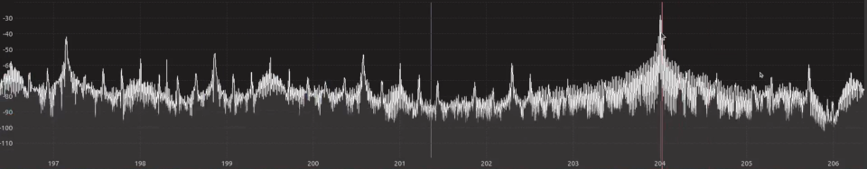
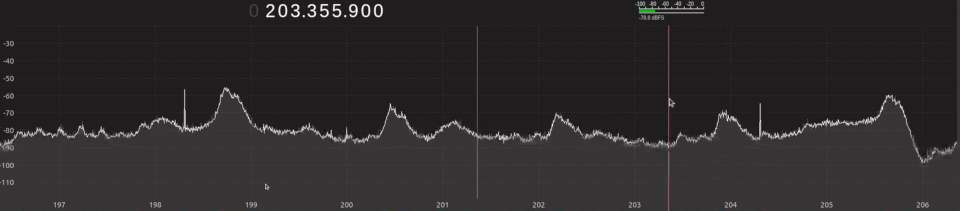
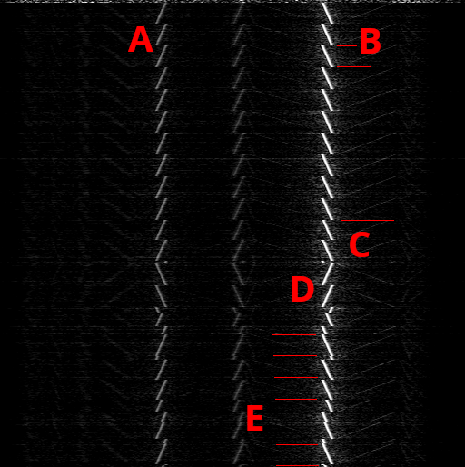

# LoLRa

*Transmit 900MHz LoRa frames surprisingly far without a radio*

 * [Introduction](#introduction)
 * [Background](#background)
 * [LoRaWAN](#lorawan)
 * [Limitations](#limitations)
 * [Future Work](#future_Work)
 * [Resources](#resources)
 * [Special Thanks](#special_thanks)
 * [Range Tests](#range_tests)

## Introduction

Firmware-only LoRa transmission, for a variety of processors. Send LoRa packets, without any radio, chips, external hardware or built-in radios at all on a variety of common, inexpensive processors. While not truly bit banging, this repository shows how using either a shift register (i.e. I2S or SPI port) or an APLL, you can send LoRa packets that can be decoded by commercial off the shelf LoRa gateways and other chips.

> [!NOTE]
> This repo is designed for use with ITU Region 2 (The Americas) tageting 902-928MHz. Code changes are needed for use in Region 1 (EU, Russia, Africa) to target 863-870MHz or Region 3 (Australia, China, India) to target 920-923MHz.

> [!CAUTION]
> Because we rely on harmonics and aliasing, the primary frequency components emitted by your microcontroller are going to be in portions of the RF spectrum where RF transmissions are banned.  Please filter your output or perform your tests in an area where you are unlikely to leak significant RF.  The overall EIRP output is genreally ≪300uW across the whole spectrum spread out over hundreds of emission frequencies, but there is virtually no way a device deliberately transmitting on these frequencies could ever pass FCC part 15 compliance, even with filtering. 

There are two major modes that this repository works with.

1. Transmission using a tunable PLL, creating a square wave, then using a harmonic (the 13th harmonic in the case of the ESP32-S2) and then transmitting the signal out a clock out pin.
2. Direct synthesis on a bitstream, a much more versatile method able to work on a myriad of microcontrollers.  This creates an image of the intended bitstream up at 900 MHz, even in situations where the bitstream itself can be as low as 7.2 MSPS. But for most platforms, I've targeted between 24 and 173 MSPS.

Click Below for the Youtube Video version of this page:

> [!NOTE]
> Portions of code in this repo are under various licenses and cannot be trivially incorporated into other libraries without a bit of a mess, including a no-ai-training license for any of the RF-specific portions of the project. Be cautious when using code from this repo. See  for more information.

## Background

### Square waves, and images

Any time a signal changes state from low to high or high to low, a disturbance is created in the electromagnetic fields surrounding that wire.  Any time.  The difference is, are you, as an engineer, going to fear it, squelching it waddling, being afraid of whatever EMI it might cause, or are you going to grab the bull by its horns and emit some artisanally crafted signals?  The major principles you will need to understand are:

 * The actual emission of a wave is made from several frequency components at different frequencies and phases.  You can read more about it [in this wolfram article](https://mathworld.wolfram.com/FourierSeriesSquareWave.html) or [This 3Brown1Blue Video](https://www.youtube.com/watch?v=spUNpyF58BY)
 

 * A pure sinewave has only its principle output wave in frequency space.

 * You can create a high frequency tone by generating a low frequency tone (Pictured is a 13th harmonic of at 69.420MHz signal)

 * You can spread a signal over an area of spectrum by scanning it between frequencies. (There are other ways, but that isn't LoRa)

 * Square waves are actually several "odd harmonic" frequencies all added together.

 * It is important to note that many more cheap micros frequencies cut off rather quickly at high frequencies.

The second principle is signal mixing.  If you create a signal, then "mix" it with a high frequency, you get an "image" wrapped around that high frequency.  Mixing can be done with diodes, special RF equipment, or even just sampling, like that done by using a shift register, outputting bits at a steady rate.

Now the real magic happens, when you realize these two principles actually work together. You get an image at the base band, a reflected image around the sampling frequency, then around ×3 the sampling frequency, you get another 2 images, the forward and reverse.  And ×5, and ×7, etc.

With this, with a precise enough clock, we can arbitrarily generate any frequency we wish, provided there's enough bandwidth left on the GPIO of our micro to generate it, even if the "actual" signal we're generating is much much lower in frequency.

#### A side-note: RC/RLC oscillators vs crystal oscillators.

Internal oscillators in microcontrollers aren't only inaccurate, but they also jitter around in frequency. You might think this a negative, but in fact, using the internal oscillator built into micros can often be a lifesaver, getting you past EMI/EMC.  Because the internal oscillators aren't just imprecise but jittery, they prevent harmonics of individual frequencies higher up in the spectrum because the clock rate drifts around so heavily. 

Crystal Output:

RC Output:

### LoRa signals (40,000' view)

See the section below for the nitty gritty of how LoRa signals *actually work* or the things that none of the other PhDs on the internet ever were willing to tell you about it.

LoRa typically operates in the 433MHz or the 900MHz spectrum, usually with 125kHz channels. In principle, LoRa creates chirps, starting at one frequency, 62.5kHz below the channel center, then over a short period of time (1.024uS at SF7) the tone creeps up to 62.5kHz above the channel center. 

While LoRa can be used with many different channel widths, 125kHz and 500kHz are both very well supported, whereas other channel widths are not configurable with routers like the LR9.

This diagram shows frequency on the X axis, and time on the Y axis (top to bottom)... You can see:
 * **𝔸** our output on a platform like the CH32V203 is not perfect, that's because the SPI bus on the CH32V203 glitches by parts of a bit here and there.  This causes other, weaker images in the output. But, largely we can produce totally valid and readable (at a long distance) LoRa packets. 
 * **𝔹** LoRa consists of several upchirps some in a preamble.
 * **ℂ** two more upchirps with a phase offset indicating a sync word if we select 0x43 (or 0x34 depending on endian) for the upchirps here, our packets will be decoded and potentially forwarded by commercial LoRa gateways.
 * **𝔻** 2.25 down chrips in. That extra .25 causes some pain 😈 (the minimum logical unit is a quarter chirp, not a whole chirp). 
 * Then a payload where each upchirp is offset by a phase to convey information in **𝔼**. 
 
Conveniently the window for a given chirp is stable depending on the spreading factor.  For the above packet, with SF7, it works out to 1,024us per symbol, or for SF8, 2,048us per symbol.  Each symbol/chirp can represent a number of bits, by a phase offset.

The raw "phase" of a chirp is grey-coded in order to better spread the bit error between bits to higher layers of the process. For instance, if you are off-by-one with regards to the phase you believe the chirp is at, it could be over a boundary from say 0b1111 and 0b10000 and would cause 5 bit errors.  By grey coding it, it minimizes the bit errors created by an off-by-one or even a few of the phase.

After this raw bitstream is decoded from the individual chirps and de-grey-coded (see `encodeHamming84sx`) in [`LoRa-SDR-Code.h`](https://github.com/cnlohr/lolra/blob/master/lib/LoRa-SDR-Code.h), then we transpose/interleve the bits so any one symbol that could get taken out (see `diagonalInterleaveSx`) to spread any errors out so a single lost symbol can be recovered and whitened (I believe this is actually a worthless step in this protocol, correct me if I'm wrong) see `Sx1272ComputeWhitening`.  Above whitening is an error correction layer to help fix any of the bit errors that could happen at a lower layer (see `encodeFec`). 

Overall the messages have a header, and a payload.  Note that this can be a little tricky, because the header sometimes uses different encoding settings than the payload.  And that's it.

Once you generate properly formatted packets, you can encode them into chirps and transmit them out the wire.

A more detailed view of the protocol can be found [here, for a more academic view](https://dl.acm.org/doi/10.1145/3546869) and [here for some better examples](https://chrisye-liu.github.io/files/yang22emu.pdf) (though I have found some issues with the correctness/clarity of both documents).

### Starting the Project

I started the project with an ESP32-S2 to see if I could output a signal using the internal built-in APLL, and routing the APLL/2 clock out via the IOMUX, and the answer was I could.  Because this generates a simple square wave, and square waves have harmonics at F×3, F×5, F×7, etc... up the spectrum, if I set the APLL to 139.06 MHz, it outputs 69.53MHz.  The 13th harmonic is 903.9 MHz, or the first 125kHz LoRa channel. Then by tuning the least significant PLL control bits, we can tune it from 903.9 MHz - 62.5kHz to 903.9 + 62.5kHz, by tuning the APLL to 139.06 MHz - 9.62kHz to 139.06 MHz + 9.62 kHz.  This lets us generate the characteristic LoRa chirps and indeed this is receivable!

The ESP32-S2 also has another trick - the GPIO mux is capable of outputting a signal or the inverse of that signal.  That way we can differentially create the 139.06MHz signal, boosting the power output by 3dB!

There are issues with the ESP32-S2, however.  Notably that:
1. The APLL is quite rough since it's fundamentally an analog device and struggles to keep tight control on the output signal.
2. Its output looks very unusual, and is something that limits the performance of the sending of frames.
3. Because it is operating down at the F÷13 node, it has to operate over a very, very small window, ±9.62 kHz, which is quite challenging.

Additioanlly, very few processors even have an APLL, so in spite of this fast success, I decided to move onto...

### Direct bitstream synthesis

Several years ago, I did a number of projects that used direct bitstream synthesis to do a few things, like [Broadcasting RF Color NTSC television on Channel 3 with an ESP8266](https://www.youtube.com/watch?v=bcez5pcp55w) or [Using Ethernet Packets to transmit AM radio](https://www.youtube.com/watch?v=-7jlRfqaYuY).  One of the neat tricks is, if you transmit a bitstream out on an SPI or I2S shift register, it causes aliasing at the sample rate, with images at F×3, F×5, F×7, etc.  But, the neat part is it preserves the size/shape of the transmitted waveform at images/aliases up the spectrum.  For Channel 3, the 65MHz signal was being refelcted around the 40MHz sampling rate. Harry Nyquist can go bite a lemon. 

This technique gives an incredible amount of fidelity even in extremely poor situations, unintuitively so.  You can create surprisingly precise signals way outside anywhere you would expect them.

There are several ways to accomplish this, but typically it's easiest with a shift register.  A shift register like that in an I2S or SPI bus.  And, if you use DMA, you can easily feed the shift register with more data without waking the CPU up every cycle.  There are other ways, though, such as directly toggling an IO, or using a timer to turn an IO on and off at the right time, but it's easiest to write code to generate a bitstream and shift it out.

For shift registers, a few considerations must be made, such as making sure that the endianness and bit widths and memory arrangements are correct, but, in general, you can keep up, and unless there is lag, like time between each word, they are typically able to faithfully-enough represent a bit pattern on output to be transferred and shifted out of a pin.

The "lohrcut" described in the video involves writing a function that, given a point in time, determines the amplitude of a signal.  This function can be to determine the amplitude of a very high frequency signal, then, the sample rate can be whatever physically realizable sample rate that's avaialble.  This will create an image of the high frequency signal at a much lower frequency signal, building it out of power between 0 and Fs/2.  

Another concern is flash, on some systems accesses inconsistently or doesn't work well at certain frequencies.  In those cases, like on the ESP8266, the tables must be read into RAM and played from there.

## LoRaWAN

LoRa frames are totally encapsulated.  If you wanted, we could stop here.  You could even use a commercial gateway, but without using LoRaWAN, the frames could not be sent to brokers like The Things Network.  For instance, if you ran a raspberry pi gateway, you could just accept whatever old LoRa frames you wanted, but, we took this a step further by helping the packets get forwarded around the world. LoRaWAN is "end to end" encryption, in that none of your neighbors, or gateways can read the messages.  Though, it is curious - The Things Network CAN read your messages because they have the encryption keys.

Conveniently, you can call, `GenerateLoRaWANPacket` in [`lib/lorawan_simple.h`](https://github.com/cnlohr/lolra/blob/master/lib/lorawan_simple.h) handles all of the required encapsulation.  Simply use this function to generate your frames, and broadcast them!

### The LoRa Gateway

We can transmit these messages. Cool.  But now to receive them, we will either need a devices like a [LILYGO® T-Beam Meshtastic](https://www.lilygo.cc/products/t-beam-v1-1-esp32-lora-module) or a gateway like a [MikroTik LR9](https://mikrotik.com/product/wap_lr9_kit).  The latter is really interesting here because there are thousands of these set up all over the world, and connected to [The Things Network](https://www.thethingsnetwork.org/).  That means if we transmit a properly formatted LoRaWAN packet within earshot of one of those gateways, we can get the frame elsewhere on the planet!

Setup is pretty starightforward.  You need to:
1. Create an account (they are free for personal/academic use)
2. Go to your console.
3. Create a new application.
4. Add a new device.
5. Select "Enter end device specifics manually"
6. Select the appropriate frequency plan.  NOTE: This repository is designed around US FSB 2 (used by TTN)
7. Use LoRaWAN 1.0.0
8. "Show advanced activation, LoRaWAN class and cluster settings"
9. Select "Activation by personalization (ABP)"
10. Generate "Device Address", "AppSKey", and "NwkSKey"
11. Select "Register end device"
12. Place these credentials into the file under the LoRaWAN definition.
13. Unless you can guarantee increasing frame IDs, you will need to go to your device and:
14. Select "General Settings"
15. Select "Network Layer"
16. Select "Advanced MAC settings"
17. Select "Resets frame counters"

> [!NOTE]
> We only focus on LoRa frames that reset frame counters, however, if you can store the last transmitted packet id to non-volatile flash within your part, you can avoid this step.  Without this, your device will be subject to replay attacks.

> [!NOTE]
> If using the MikroTik LR9, be sure to physically open it and plug in the internal antenna.  From the factory, it is shipped connected to the outside port.

## Limitations

PR's are open if you can figure any of these out!  I just spent all the time I plan to spend on this project before I got here.

 * SF <= 6, SF >= 11 are unavailable.  I spent 10+ hours trying to figure them out and gave up.
 * There seems to be something not quite perfect for some sizes.  As in I was getting CRC errors in some places that my code "should" work but doesn't.
 * I never got LDRO to work correctly.  I believe it might have to do with the LoRa Code Word (prefixing the 2 downchirps)
 * The SPI on the ch32v203 still isn't perfect.  I was unable to get the I2S engine working, perhaps it doesn't work on the ch32v203?
 * The licenses in this project are a hodgepodge. I encourage people to just use this project as a starting point for other work.

## Future Work

For LoRa specifically, waves are very well behaved and should be completely creatable with timer circuitry on the fly and should not need any precomputation, but I haven't gotten around to it yet.  This would forego the need to have a large table for the chirps flashed into a device.

I want to also try performing this project using bespoke bit patterns that are more easily created on-the-fly.  Also, depending on the exact codes used (possibly by employing technologies related to gold codes) one could even make reception of many signals with the exact same coding possible concurrently.  Doing this would make it quite appropriate to implement "printf" on microcontrollers that can be wirelessly received by a central SDR with very low processor space (and performance) overhead.

Additionally, it would be fun to add a filter, or maybe try to build a filter into a PCB with no components.  

Additionally, additionally, it would be very cool to try to build a Class C amplifier for the 900MHz signal.  This would be very cool because it could be efficient, incredibly cheap and simple and also provide as much as 10-20dB of gain!

## Range Tests

Urban testing was performed on 2024-02-23, Suburban on 2022-02-26 and Rural testing was performed on 2022-02-27.

Ranges are peak ranges.  Reliable operation ends much earlier.

For TTGO Lora32, there was a +3dBi antenna added.  For the MikroTik LR9, it used the internal antenna.
| Date       | Sender              | Receiver     | SF/CR     | BW  | Note                                               | Range         | Avg End RSSI/SNR | Basis  |
|------------|---------------------|--------------|-----------|-----|----------------------------------------------------|---------------|------------------|--------|
| 2024-02-23 | CH32V203            | MikroTik LR9 | SF8/CR48  | 125 | Downtown Bellevue (Urban)                          | 435' 132m     | -98 / -9         | Ground |
| 2024-02-23 | CH32V203            | MikroTik LR9 | SF10/CR48 | 500 | Downtown Bellevue (Urban)                          | 435' 132m     | -90 / -18        | Ground |
| 2024-02-26 | CH32V203            | TTGO Lora32  | SF8/CR48  | 125 | Miramont Park (Light Suburban + Woods)             | >576' >176m   | -134 / -12       | Ground |
| 2024-02-26 | CH32V203            | TTGO Lora32  | SF8/CR48  | 125 | Poo Poo Point Trailhead (Rural)                    | >1117' >340m  | -123 / -6        | Ground |
| 2024-02-26 | CH32V203            | TTGO Lora32  | SF8/CR48  | 125 | Issaquah Suburb (+Light Trees)                     | 2200' 669m    | -133 / -10       | Ground |
| 2024-02-27 | CH32V203            | TTGO Lora32  | SF8/CR48  | 125 | Meadowbrook (Rural) Red Longer Antenna             | 2220' 677m    | -135 / -13       | Drone  |
| 2024-02-27 | CH32V203            | TTGO Lora32  | SF10/CR48 | 500 | Meadowbrook (Rural) Red Longer Antenna             | 1752' 534m    | -132 / -16       | Drone  |
| 2024-02-27 | CH32V203            | TTGO Lora32  | SF8/CR48  | 125 | Meadowbrook (Rural) OVERVOLT 5V Red Longer Antenna | 3996' 1218m   | -131 / -12       | Drone  |
| 2024-02-27 | CH32V203            | TTGO Lora32  | SF8/CR48  | 125 | Meadowbrook (Rural) Grey VNA Matched Antenna       | 2719' 829m    | -131 / -11       | Drone  |
| 2024-02-27 | ESP8266 @ 80MHz     | TTGO Lora32  | SF8/CR48  | 125 | Meadowbrook (Rural) Grey VNA Matched Antenna       | 2789' 850m    | -138 / -13       | Drone  |
| 2024-02-27 | ESP8266 @ 173MHz    | TTGO Lora32  | SF7/CR48  | 125 | Meadowbrook (Rural) Grey VNA Matched Antenna       | 2812' 857m    | -131 / -8        | Drone  |
| 2024-02-27 | ESP32-S2 + Bitenna  | TTGO Lora32  | SF10/CR48 | 125 | Meadowbrook (Rural) (Note 1)                       | 3428' 1044m   | -137 / -13       | Ground |
| 2024-02-27 | ESP32-S2 + Bitenna  | TTGO Lora32  | SF10/CR48 | 125 | Meadowbrook (Rural)  Light Precipitation           | >4895' >1492m | -130 / -8        | Drone  |
| 2024-02-27 | ESP32-S2 + Funtenna | TTGO Lora32  | SF10/CR48 | 125 | Meadow brook (Rural)  Light Precipitation          | 705' / 215m   | -139 / -15       | Drone  |
| 2024-02-27 | ESP32-S2 + Bitenna  | TTGO Lora32  | SF10/CR48 | 125 | Snoqualmie Trail, Dog Park to Ribary Creek (Rural) Light Percipitation | 8460' / 2580m | -141 / -16       | Drone  |

1. There were two ground ESP32-S2 + Bitenna Tests.  The one mentioned in the video is not recorded here, since I didn't get accurate results.
2. The bitenna ESP32-S2 test are done as a dipole antenna, connected to two different GPIOs, each set as the inversion of the other.
3. On the CH32V203, there is a 60 uA difference at 3.3V with anteanna on/off (some is going to be capacitive / inductive loading / reflected back because of SWR).  The EIRP is **less** than this, based on the antenna stub SWR, but this is the total power consumption, so it is probably less than 120uW of EIRP.

## Resources

### LoRa Software
 * [The C++ Library I based my LoRa Frames On](https://github.com/myriadrf/LoRa-SDR)
 * [A gnuradio LoRa library](https://github.com/tapparelj/gr-lora_sdr)
 * [Another gnuradio LoRa library](https://github.com/rpp0/gr-lora)
 * [GQRX](https://www.gqrx.dk/)
 * [gnuradio](https://www.gnuradio.org/)
 * [LoRa Baud Rate Calculator](https://unsigned.io/understanding-lora-parameters/) << be sure to select 125 or 500k Bandwidths, the default bandwidth is not useful. 
 
### Papers and other resources
 * [A Great LoRa Introduction](https://medium.com/@prajzler/what-is-lora-the-fundamentals-79a5bb3e6dec)
 * [A more grounded paper on LoRa](https://chrisye-liu.github.io/files/yang22emu.pdf) 
 * [Reversing LoRa by Matt Knight](https://github.com/matt-knight/research/blob/master/2016_05_20_jailbreak/Reversing-Lora-Knight.pdf)
 * [An academic paper on LoRa](https://dl.acm.org/doi/10.1145/3546869)
 * Brought to my attention after I published, [Everything has its Bad Side and Good Side: Turning Processors to
Low Overhead Radios Using Side-Channels](https://dl.acm.org/doi/abs/10.1145/3583120.3586959) Accomplished something very similar to this, with an arduino!

### Software Resources Directly Used
 * [ch32v003fun](https://github.com/cnlohr/ch32v003fun)
 * [esputil](https://github.com/cpq/esputil) dependency-free ESP programming
 * [nosdk8266](github.com/cnlohr/nosdk8266)

### Hardware
 * [MikroTik LR9](https://mikrotik.com/product/wap_lr9_kit)
 * [Airspy Mini SDR](https://v3.airspy.us/product/a-airspy-mini/)
 * [LILYGO® T-Beam Meshtastic](https://www.lilygo.cc/products/t-beam-v1-1-esp32-lora-module)

## Special Thanks
 * @MustardTiger for a crazy amount of support work in this project
 * Willmore for the editing work
 * Several other folks in my discord for review work and editing work on this page
 * My girlfriend for testing help and auxiliary camera work
 * Everyone who helped out with my various open source projects

